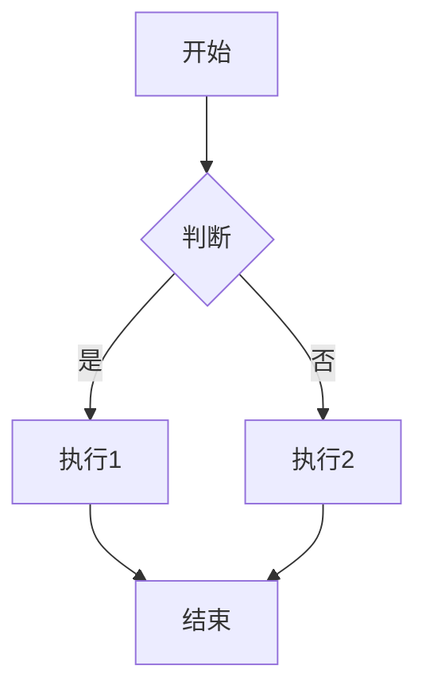

**user**: 我该如何写obsidian的笔记才能最好看
[Context: Notes: 基础知识点]
[Timestamp: 2025/10/28 19:10:00]

**ai**: <think>我们追求美观的Obsidian笔记，可以从以下几个方面入手：

1. **结构清晰**：使用标题（`#` 到 `######`）来组织内容层次，让笔记有清晰的大纲。
2. **使用列表**：有序列表和无序列表可以让条目更清晰。
3. **表格**：用表格来整理数据，使得数据易于阅读。
4. **代码块**：如果你有代码，使用代码块（```）并指定语言，这样会有语法高亮。
5. **数学公式**：使用LaTeX格式来书写数学公式，Obsidian支持渲染数学公式。
6. **图片和链接**：插入图片和链接，让笔记更生动。内部链接使用`[[笔记名]]`，图片使用`![[图片名]]`。
7. **使用注释**：如果你有一些不想在阅读模式下显示的内容，可以使用`%%`注释掉。
8. **使用标签**：通过标签（`#标签`）来分类笔记，便于后续检索。
9. **使用高亮**：使用`==高亮==`来标记重要内容。
10. **使用任务列表**：使用`- [ ]`和`- [x]`来管理任务。
11. **使用引用**：使用`> `来表示引用，突出显示引用的内容。
12. **使用分隔线**：使用`---`或者`***`来分隔不同部分。
13. **使用Mermaid图表**：Obsidian支持Mermaid图表，可以绘制流程图、序列图等。

另外，Obsidian有很多主题和插件可以增强视觉效果，你可以尝试安装一些主题（如Minimal、Things等）和插件（如Admonition、Dataview等）来美化笔记。

下面是一个简单的例子：

```markdown
# 我的笔记

## 第一部分

这是一个段落，里面有一个**加粗**和*斜体*。

### 子部分

- 列表项1
- 列表项2
- 列表项3

## 第二部分

这是一个表格：

| 姓名 | 年龄 | 职业 |
|------|------|------|
| 张三 | 25   | 工程师 |
| 李四 | 30   | 设计师 |

## 第三部分

这里是一段代码：

```python
def hello_world():
    print("Hello, World!")
```

## 第四部分

这里是一个数学公式：

$$ E = mc^2 $$

## 第五部分

这里是一张图片：

![[示例图片.png]]

## 第六部分

这里是一个任务列表：

- [ ] 任务1
- [ ] 任务2
- [x] 已完成任务

## 第七部分

这里是一个引用：

> 这是引用的内容。

## 第八部分

这里是一个高亮：==这是高亮的内容==

## 第九部分

这里是一个分隔线：

---

## 第十部分

这里是一个Mermaid流程图：



```

希望这些建议能帮助你写出美观的Obsidian笔记！</think>要让Obsidian笔记既美观又实用，可以从以下几个方面入手：

## 🎨 格式美化技巧

**1. 结构清晰**
- 使用多级标题组织内容（# H1 → ###### H6）
- 合理使用分隔线 `---`
- 保持段落间距适中

**2. 视觉元素**
```markdown
**加粗重要内容**
*斜体强调*
==高亮关键信息==
`代码片段`
```

**3. 列表与表格**
- 有序列表和无序列表混合使用
- 表格对齐数据：
```
| 属性 | 类型 | 说明 |
|------|------|------|
| 名称 | 文本 | 文件名称 |
| 大小 | 数字 | 文件大小 |
```

## 📁 组织架构

**1. 链接网络**
- 使用 `[[笔记名称]]` 创建内部链接
- 建立笔记间的关联关系
- 利用反向链接发现新连接

**2. 标签系统**
- 在YAML frontmatter中添加标签：
```yaml
---
tags: [机器学习, 基础]
---
```

## 🛠️ 实用工具

**1. 代码块**
````markdown
```python
def example():
    return "格式化代码"
```
````

**2. 数学公式**
- 行内公式：`$E = mc^2$`
- 块级公式：`$$ \sum_{i=1}^n i = \frac{n(n+1)}{2} $$`

## 💡 进阶美化

**1. 使用CSS代码块**
```css
/* 自定义样式 */
.callout {
  background: #f0f8ff;
  padding: 10px;
  border-left: 4px solid #1890ff;
}
```

**2. 嵌入内容**
- 图片：`![[图片名称.png]]`
- 音频/视频文件
- PDF文档

## 实用建议

1. **保持一致性**：建立自己的格式规范
2. **适度美化**：避免过度装饰影响阅读
3. **移动端友好**：考虑在不同设备的显示效果
4. **定期整理**：清理无效链接，优化结构

你现在打开的[[基础知识点]]笔记就是一个很好的起点，可以按照这些建议逐步完善！需要我针对某个具体方面详细说明吗？
[Timestamp: 2025/10/28 19:10:53]