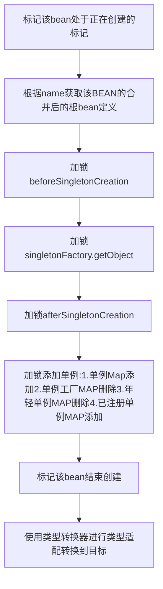
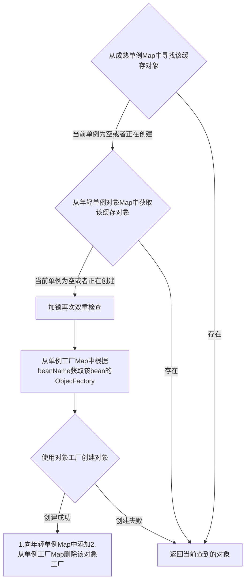
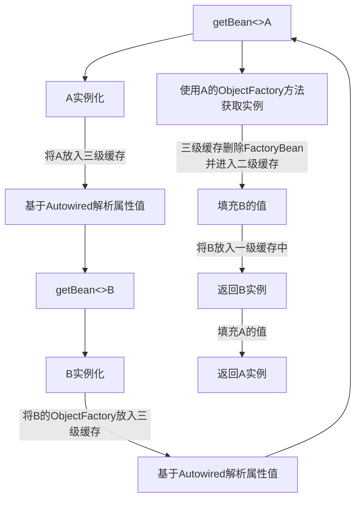
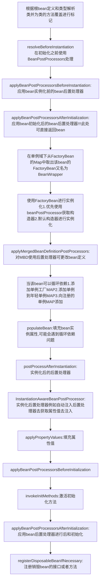

[TOC]

# bean的生命周期

**Spring IOC容器可以管理bean的生命周期，Spring允许在bean生命周期内特定的时间点执行指定的任务。**

+ 初始化：init ——>Tomcat启动，Servlet对象就创建/初始化了
+ 服务：service——>浏览器发送请求，对应的Servlet进行处理调用
+ 销毁：destroy——>Tomcat停止

## 从未创建的bean的整体单例过程

## bean如何从单例Map缓存集合中获取

## 如何解决循环依赖问题

知识点一: 三级缓存MAP

1.private final Map<String, Object> singletonObjects = new ConcurrentHashMap<>(256);

> 一级单例缓存，成熟单例MAP

2.private final Map<String, Object> earlySingletonObjects = new ConcurrentHashMap<>(16);

> 二级单例缓存,年轻或早期单例MAP

3.private final Map<String, ObjectFactory<?>> singletonFactories = new HashMap<>(16);

> 三级单例缓存，单例工厂缓存MAP

4.private final Set<String> registeredSingletons = new LinkedHashSet<>(256);

> 注册单例集合名称集合

知识点二：类A和类B, A依赖B, B依赖A

注意: 先放入单例工厂缓存的三级缓存可以帮助更好的代理对象

## 使用ObjectFactory(FactoryBean)创建bean实例

## 关于Aware接口的分析

带有aware后缀的接口，主要是针对于实现了此类接口的bean，这也就意味着 aware是特指 有特殊能力的bean

