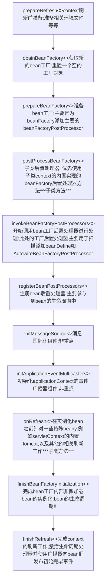

# IOC的认识之路

[TOC]

外部bean的加载  -> IOC

内部bean的加载  -> IOC

自定义bean的加载 -> IOC

了解springapplication 过程 ，了解 类加载过程， 了解 默认IOC容器的 选择  

## IOC概述

IOC（Inversion of Control**控制反转**），是面向对象编程中的一种设计原则，可以用来**降低代码中的耦合度**，IOC思想基于IOC容器完成，底层就是对象工厂，而IOC的具体实现是依赖于XML解析、工厂模式、反射机制

## 为什么采用IOC

在企业级应用的不断开发探索中，IOC的设计主要是为了实现组件与组件之间的解耦，提高程序的灵活性和可维护性

### 第一阶段 对象与对象之间的耦合

对象与对象之间最简单的调用方式莫过于直接new一个对象，并调用其方法完成对其依赖的动作，但是如果后续需要对该组件替换成其不同厂商的实现或者代理增强扩展，都将是一件麻烦事情。


### 第二阶段 对象与工厂之间的耦合--工厂模式解耦

在java  中，所有的对象都需要创建，若在创建时直接new该对象，会出现该对象耦合严重的现象，假设我们要更换对象，所有的new对象的地方都需要修改一次，这显然不便于开闭使用，若我们使用工厂来生产对象，只跟工厂打交道，就彻底和对象解耦，若有更换直接在工厂内选择更换该对象即可，达到与对象解耦的目的。所以说工厂模式最大的优点是：解耦。


### 第三阶段 非直接耦合--IOC(DI依赖注入)解耦

IOC解耦模式，其中依旧采用了工厂模式，但对象并不直接依赖工厂创建其依赖的对象，而是工厂事先根据配置好的对象间的依赖关系创建好对象，程序员只需关心如何去配置这种依赖关系和使用即可，而创建过程无需关注。

#### 如何理解控制反转？


图中是IOC容器通过factoryBean创建对象的模拟过程，因此可以看出，原本我们对象创建的控制权是由程序员自己决定的，现在我们某一接口具体实现类的选择控制权从调用类中移除，转交给第三方（Spring）决定,写在配置文件中。

#### 换个角度理解DI依赖注入

因为IoC确实不够开门见山，因此业界曾进行了广泛的讨论，最终软件界的泰斗级人物Martin Fowler提出了DI（依赖注入：Dependency Injection）的概念用以代替IoC，即让调用类对某一接口实现类的依赖关系由第三方（容器或协作类）注入，以移除调用类对某一接口实现类的依赖。

#### 优缺点的衡量

这种创建对象方式对企业级应用需要管理大量对象来说具有较高的可维护、可扩展性，由于其对象高度内聚且对象间只存在使用关系，因此程序员在大多数场景只需要关注对象间的业务关系，实现其业务逻辑即可

缺点：

1.涉及对象创建和内存分配的关系被隐藏在spring中，出现问题时通过调试发现问题的难度增加

2.创建过程复杂，尽管极小的程序也需要完整的IOC容器的创建过程，固定的性能损耗

3.不易理解，增加学习成本，如果由IOC框架开发应用，不学习其相关特性，较难上手

## spring中的IOC设计

在spring中对IOC的设计由ApplicationContext作为基础规范接口所定义，同时是基于底层接口BeanFactory的扩展，因此IOC容器的底层原理由beanFactory的实现所承接。

**默认的IOC容器——AnnotationConfigServletWebServerApplicationContext探索**： 

该context继承 ServletWebServerApplicationContext 并且实现 AnnotationConfigRegistry接口，该接口意味着扩展该serveletcontext通过注解式配置servlet的能力

> Object
>
> > DefaultResourceLoader --> ResourceLoader   
> >
> > 从context的最低级接口可以看出，context的核心基础是资源加载，初步具备的是资源加载的能力，换句话说spring将一切类视作reource
> >
> > > **AbstractApplicationContext** --> ConfigurableApplicationContext --- ApplicationContext, Lifecycle, Closeable 
> > >
> > > 在抽象应用context已经是spring应用的基准context, 其中ApplicationContext接口为其重要能力，其具体细分为**environmentCapable,ListableBeanFactory, HierarchicalBeanFactory,MessageSource, ApplicationEventPublisher, ResourcePatternResolver**这些能力, 其中核心能力则为**BeanFactory**
> > >
> > > >**GenericWebApplicationContext** --> ConfigurableWebApplicationContext, ThemeSource通用web应用context,具备可配置化的APPLICATIONComtext和主题资源 该接口非常重要 奠定基础，其实通用webApplicationContext已经继承了抽象的Applicationcontext已经是实现了ConfigurableApplicationContext， 但WebApplicationContext接口并未实现该接口扩展web容器的可配置能力
> > > >
> > > >>**ServletWebServerApplicationContext** --> ConfigurableWebServerApplicationContext servle的webServerApplicationdContex实现ConfigurableWebServerApplicationContext接口,实现它后，可以获得管理 WebServer 的能力,使用springboot之后，我们不再需要配置web服务器，因为springboot帮我们集成了例如tomcat 等servelet容器
> > > >>
> > > >>> **AnnotationConfigServletWebServerApplicationContext** --> AnnotationConfigRegistry
> > > >>>
> > > >>> 选择的注解配置注册器，该注册器具备注册多个组件(@component)的能力和扫描规定的基准包的能力

**认识BeanDefinitionRegistry  bean定义注册器**

```java
package org.springframework.beans.factory.support;

import org.springframework.beans.factory.BeanDefinitionStoreException;
import org.springframework.beans.factory.NoSuchBeanDefinitionException;
import org.springframework.beans.factory.config.BeanDefinition;
import org.springframework.core.AliasRegistry;

/**
bean定义涵盖bean中所有的元信息和依赖关系

   该接口主在spring  bean工厂接口包中只是用于bean定义相关的功能，而实例化的工作交给bean工厂

 默认实现在DefaultListableBeanFactory 和 GenericApplicationContext
 **/
public interface BeanDefinitionRegistry extends AliasRegistry {

   /**
		bean定义的注册
    */
   void registerBeanDefinition(String beanName, BeanDefinition beanDefinition)
         throws BeanDefinitionStoreException;

   /**
		bean定义的删除
    */
   void removeBeanDefinition(String beanName) throws NoSuchBeanDefinitionException;

   /**
		bean定义的获取
    */
   BeanDefinition getBeanDefinition(String beanName) throws NoSuchBeanDefinitionException;

   /**
		bean定义存在的判断
    */
   boolean containsBeanDefinition(String beanName);

   /**
    * Return the names of all beans defined in this registry.
    * @return the names of all beans defined in this registry,
    * or an empty array if none defined
    */
   String[] getBeanDefinitionNames();

   /**
    * Return the number of beans defined in the registry.
    * @return the number of beans defined in the registry
    */
   int getBeanDefinitionCount();

   /**
    * Determine whether the given bean name is already in use within this registry,
    * i.e. whether there is a local bean or alias registered under this name.
    * @param beanName the name to check
    * @return whether the given bean name is already in use
    */
   boolean isBeanNameInUse(String beanName);

}
```

注解版bean定义的注册

> AnnotatedGenericBeanDefinition abd = new AnnotatedGenericBeanDefinition(beanClass);
>
> > ```java
> > // 关键：对bean的类型进行检查获取到注解的元数据
> > public AnnotatedGenericBeanDefinition(Class<?> beanClass) {
> >    setBeanClass(beanClass);
> >    this.metadata = AnnotationMetadata.introspect(beanClass); 
> > }
> > bean定义的数据接口可见表
> > 在spring当中使用反射直接修改bean的属性是不可取的BeanUtils推荐
> > 
> > ```

**BeanFactory接口--关于**

+ 该接口的实现是基于携带大量有beanName标识的bean定义的对象，Spring2.0之前所获得的bean实例可以是单例或者多例，之后根据具体的Web环境下的ApplicationContext的实现来新增request、 session模式

+ beanFactory是应用组件的注册中心，并对组件集中配置， 了解更多详情Expert One-on-One J2EE Design and Development
+ 该接口实现了依赖注入，其模式是push Configure 的动作，其实现形式是 . setter注入和构造器注入
+ ListableBeanFactory,HierarchicalBeanFactory 这两个关键的子接口，区别在于HierarchicalBeanFactory可以子工厂和父工厂相同bean会覆盖

+  bean的生命周期 下次回顾
  1. BeanNameAware's setBeanName
  2. BeanClassLoaderAware's setBeanClassLoader
  3. BeanFactoryAware's setBeanFactory
  4. EnvironmentAware's setEnvironment
  5. EmbeddedValueResolverAware's setEmbeddedValueResolver
  6. ResourceLoaderAware's setResourceLoader (only applicable when running in an application context)
  7. ApplicationEventPublisherAware's setApplicationEventPublisher (only applicable when running in an application context)
  8. MessageSourceAware's setMessageSource (only applicable when running in an application context)
  9. ApplicationContextAware's setApplicationContext (only applicable when running in an application context)
  10. ServletContextAware's setServletContext (only applicable when running in a web application context)
  11. postProcessBeforeInitialization methods of BeanPostProcessors
  12. InitializingBean's afterPropertiesSet
  13. a custom init-method definition
  14. postProcessAfterInitialization methods of BeanPostProcessors
+ bean工厂的关闭时的bean生命周期
  1. postProcessBeforeDestruction methods of DestructionAwareBeanPostProcessors
  2. DisposableBean's destroy
  3. a custom destroy-method definition

```java
public interface BeanFactory {

	String FACTORY_BEAN_PREFIX = "&";

	Object getBean(String name) throws BeansException;

	<T> T getBean(String name, Class<T> requiredType) throws BeansException;

	Object getBean(String name, Object... args) throws BeansException;

	<T> T getBean(Class<T> requiredType) throws BeansException;

	<T> T getBean(Class<T> requiredType, Object... args) throws BeansException;

	<T> ObjectProvider<T> getBeanProvider(Class<T> requiredType);

	<T> ObjectProvider<T> getBeanProvider(ResolvableType requiredType);

	boolean containsBean(String name);

	boolean isSingleton(String name) throws NoSuchBeanDefinitionException;

	boolean isPrototype(String name) throws NoSuchBeanDefinitionException;

	boolean isTypeMatch(String name, ResolvableType typeToMatch) throws NoSuchBeanDefinitionException;

	boolean isTypeMatch(String name, Class<?> typeToMatch) throws NoSuchBeanDefinitionException;

	@Nullable
	Class<?> getType(String name) throws NoSuchBeanDefinitionException;

	@Nullable
	Class<?> getType(String name, boolean allowFactoryBeanInit) throws NoSuchBeanDefinitionException;

	String[] getAliases(String name);

}
```

注解配置注册器接口

```java
package org.springframework.context.annotation;

/**
 * Common interface for annotation config application contexts,
 * defining {@link #register} and {@link #scan} methods.
 *
 * @author Juergen Hoeller
 * @since 4.1
 */
public interface AnnotationConfigRegistry {

	/**
	 * Register one or more component classes to be processed.
	 * <p>Calls to {@code register} are idempotent; adding the same
	 * component class more than once has no additional effect.
	 * @param componentClasses one or more component classes,
	 * e.g. {@link Configuration @Configuration} classes
	 */
	void register(Class<?>... componentClasses);

	/**
	 * Perform a scan within the specified base packages.
	 * @param basePackages the packages to scan for component classes
	 */
	void scan(String... basePackages);

}
```


### IOC容器初始化过程

IOC容器初始化的过程相当复杂，但其核心主要分为两大步骤：1.bean定义的获取 2.bean的初始化和依赖注入（bean的生命周期)

+ bean定义的获取
  - resource定位
  - bean定义的载入
  - bean定义的注册
    bean的初始化和依赖注入（bean的生命周期) 
    bean的初始化和依赖注入依赖于容器本身的加载模式，懒加载模式则在调用getBean接口时才会进行加载

### IOC容器的生命周期




1.创建阶段   （AnnotationConfigServletWebServerApplicationContext）

在应用初始化阶段时，已讲过会根据类加载器对某些特定类是否能加载到而默认判定创建注解式配置servlet容器，而这个容器此时是一个空容器，内部bean需要后续去填充

```java
	public AnnotationConfigServletWebServerApplicationContext() {
		this.reader = new AnnotatedBeanDefinitionReader(this);
		this.scanner = new ClassPathBeanDefinitionScanner(this);
	}
```

第一步：这里重点解读注解式beand定义读取器，创建 AnnotatedBeanDefinitionReader,并注册与注解配置相关的后置处理器bean到bean定义注册表中

🌟 注解式bean定义读取器

1） bean名称生成器（懒汉式生成）

2） 作用域元数据解析器

3） IOC容器

4） 条件评估器

向IOC容器注册所有相关的注解后置处理器

```java
AnnotationConfigUtils.registerAnnotationConfigProcessors(this.registry);

// 1. IOC 设置 依赖比较器 DependencyComparato
// 2. IOC 设置 自动注入候选解析器 AutowireCandidateResolver
// 3. 注册Configuration注解后置处理器bean定义   ConfigurationClassPostProcessor.class  (重点分析)
// 4. 注册Autowire注解后置处理器bean定义 AutowiredAnnotationBeanPostProcessor.class  （重点分析)
// 5。注册Common注解后置处理器bean定义 CommonAnnotationBeanPostProcessor.class
// 6。注册PERSISTENCE注解后置处理器bean定义  org.springframework.orm.jpa.support.PersistenceAnnotationBeanPostProcessor  （反射加载）
// 7。注册EVENT_LISTENER后置处理器bean定义  org.springframework.context.event.internalEventListenerProcessor
// 8。注册EVENT_LISTENER_FACTORY bean定义  org.springframework.context.event.internalEventListenerFactory
```

🌟 类路径bean定义扫描器

1）注册默认过滤器 component注解的过滤器

```java
ClassPathScanningCandidateComponentProvider.class 
  // 类路径扫描候选组件提供器
  // 按照这个类一道获取类加载器（针对类路径而言）
```

2）根据过滤器扫描基准包路径过滤


第二步：创建类路径bean定义扫描器

2.  打印"spring.context.refresh" 标志，标记容器刷新的开始

   ```
   StartupStep contextRefresh = this.applicationStartup.start("spring.context.refresh");
   ```

3.   刷新前准备工作(AnnotationConfigServletWebServerApplicationContext)

   ```java
   prepareRefresh();
   ```

+ 清除本地类的元数据缓存
+ 准备容器要求的属性资源 如监听器、事件列表，环境属性等

4. 获取一个新的空的bean工厂（AnnotationConfigServletWebServerApplicationContext）

   ```java
   ConfigurableListableBeanFactory beanFactory = obtainFreshBeanFactory();
   ```

5. bean工厂的准备工作（AnnotationConfigServletWebServerApplicationContext）

   ```java
   prepareBeanFactory(beanFactory);
   
   	protected void prepareBeanFactory(ConfigurableListableBeanFactory beanFactory) {
   		// Tell the internal bean factory to use the context's class loader etc.
   		beanFactory.setBeanClassLoader(getClassLoader());
   		if (!shouldIgnoreSpel) {
   			beanFactory.setBeanExpressionResolver(new StandardBeanExpressionResolver(beanFactory.getBeanClassLoader()));
   		}
   		beanFactory.addPropertyEditorRegistrar(new ResourceEditorRegistrar(this, getEnvironment()));
   
   		// Configure the bean factory with context callbacks.
   		beanFactory.addBeanPostProcessor(new ApplicationContextAwareProcessor(this));
   		beanFactory.ignoreDependencyInterface(EnvironmentAware.class);
   		beanFactory.ignoreDependencyInterface(EmbeddedValueResolverAware.class);
   		beanFactory.ignoreDependencyInterface(ResourceLoaderAware.class);
   		beanFactory.ignoreDependencyInterface(ApplicationEventPublisherAware.class);
   		beanFactory.ignoreDependencyInterface(MessageSourceAware.class);
   		beanFactory.ignoreDependencyInterface(ApplicationContextAware.class);
   		beanFactory.ignoreDependencyInterface(ApplicationStartupAware.class);
   
   		// BeanFactory interface not registered as resolvable type in a plain factory.
   		// MessageSource registered (and found for autowiring) as a bean.
   		beanFactory.registerResolvableDependency(BeanFactory.class, beanFactory);
   		beanFactory.registerResolvableDependency(ResourceLoader.class, this);
   		beanFactory.registerResolvableDependency(ApplicationEventPublisher.class, this);
   		beanFactory.registerResolvableDependency(ApplicationContext.class, this);
   
   		// Register early post-processor for detecting inner beans as ApplicationListeners.
   		beanFactory.addBeanPostProcessor(new ApplicationListenerDetector(this));
   
   		// Detect a LoadTimeWeaver and prepare for weaving, if found.
   		if (!NativeDetector.inNativeImage() && beanFactory.containsBean(LOAD_TIME_WEAVER_BEAN_NAME)) {
   			beanFactory.addBeanPostProcessor(new LoadTimeWeaverAwareProcessor(beanFactory));
   			// Set a temporary ClassLoader for type matching.
   			beanFactory.setTempClassLoader(new ContextTypeMatchClassLoader(beanFactory.getBeanClassLoader()));
   		}
   
   		// Register default environment beans.
   		if (!beanFactory.containsLocalBean(ENVIRONMENT_BEAN_NAME)) {
   			beanFactory.registerSingleton(ENVIRONMENT_BEAN_NAME, getEnvironment());
   		}
   		if (!beanFactory.containsLocalBean(SYSTEM_PROPERTIES_BEAN_NAME)) {
   			beanFactory.registerSingleton(SYSTEM_PROPERTIES_BEAN_NAME, getEnvironment().getSystemProperties());
   		}
   		if (!beanFactory.containsLocalBean(SYSTEM_ENVIRONMENT_BEAN_NAME)) {
   			beanFactory.registerSingleton(SYSTEM_ENVIRONMENT_BEAN_NAME, getEnvironment().getSystemEnvironment());
   		}
   		if (!beanFactory.containsLocalBean(APPLICATION_STARTUP_BEAN_NAME)) {
   			beanFactory.registerSingleton(APPLICATION_STARTUP_BEAN_NAME, getApplicationStartup());
   		}
   	}
   ```

   + 设置bean类加载器
   + 设置bean EL表达式解析器和属性注册解析器（在创建实例中使用 例如setValue）
   + 添加bean后置处理器ApplicationContextdAwareProcessor，实现该ApplicationContextdAware接口的bean可以赋予bean访问ApplicationContext的能力
   + 配置bean工厂需要忽略的一些Aware接口实现类 例如ApplicationContextAware.class, 这些类不需要考虑自动装配，失效
   + 给内部相关的一些类，注册需要自动装配的能力
   + 添加bean后置处理器ApplicationListenerDetector ，可以发现实现了ApplicationListener接口的bean，
   + 注册一些系统、环境相关的一些组件单例

6. bean工厂的后置处理

   ```java
   postProcessBeanFactory(beanFactory);
   ```

   + GenericWebApplicationContext

     - 添加beanPostProcessor 之ServletContextAwareProcessor， 使得bean实现ServletContextAware接口的可直接获取ServletContext的能力
     - ServletContextAware 该接口自动装配能力失效
     - 注册WebApplication相关的Scopes   ( Request Session 除单例和多例外的)
     - 注册和WebApplication环境相关的组件单例

   + AnnotationConfigServletWebApplicationContext

     ```java
     super.postProcessBeanFactory(beanFactory);
     if (!ObjectUtils.isEmpty(this.basePackages)) {
        this.scanner.scan(this.basePackages);
     }
     if (!this.annotatedClasses.isEmpty()) {
        this.reader.register(ClassUtils.toClassArray(this.annotatedClasses));
     }
     ```

     + 包路径列表非空，扫描基础包路径  ， 因此加载
     + 带注解类列表非空，注册该类到bean定义注册表中

7. 打印激活后置处理器bean实例的标记"spring.context.beans.post-process" 

   ```java
   StartupStep beanPostProcess = this.applicationStartup.start("spring.context.beans.post-process");
   ```

8. 激活执行目前初始的BeanFactoryPostProcessor接口的实现类，此处为扩展点，可以实现额外添加自定义bean定义

```java
BeanDefinitionRegistryPostProcessor 
BeanFactoryPostProcessors
```

9. 实例化BeanPostdProcessors，在常规bean实例化之前先实例化，注册单例

   ```
   registerBeanPostProcessors(beanFactory);
   ```

10. 初始化消息源和应用事件广播器

    ```java
    initMessageSource();
    initApplicationEventMulticaster();
    ```

11. 实例化非其他特殊的beans，例如ServletWebServerApplicationContext 中创建webServer

    ```java
    onRefresh();
    ```

12. 实例化实现了监听器接口的beans

    ```java
    registerListeners();
    ```

13. 完成所有非加载的的单例实例化 （暂不扩展，重要！！！！)

    ```java
    finishBeanFactoryInitialization(beanFactory);
    ```

    > 此处十分重要，在beanFactory做完一系列工作后，已经加载完所有非懒加载的bean定义加载及beanPostProcessor后，此时开始实例化

14. 向所有监听器广播发出完成刷新的通知

    ```java
    finishRefresh();
    ```

