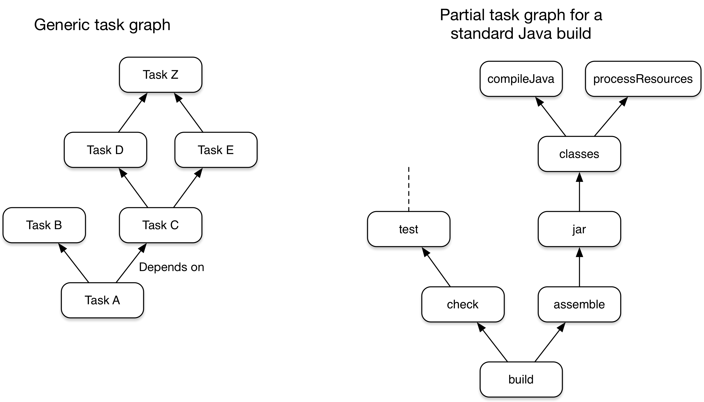

# Gradle项目管理器

[TOC]

## 构建的生命周期

Gradle是基于依赖关系编程的一个例子：定义任务和任务之间的依赖关系。Gradle保证这些任务按照依赖关系的顺序执行。您的构建脚本和插件配置此依赖关系图。本页讨论Gradle在解释这些脚本时所经历的生命周期的各个阶段。此外，本页还介绍了如何使用通知对生命周期中的事件做出反应。

## 任务图

一些构建工具在执行任务时组装任务图。Gradle在执行任何任务之前构建任务图。在避免配置的情况下，Gradle会跳过不属于当前构建的任务的配置。

一个工程则由任务为节点构成有向无环图DAG

此图显示了两个示例任务图：一个是抽象的，另一个是具体的。该图将任务之间的依赖关系表示为箭头：



插件和您自己的构建脚本都通过任务依赖性机制为任务图做出贡献。

## 构建阶段

Gradle 构建有三个不同的阶段。Gradle 按顺序运行这些阶段：首先初始化，然后配置，最后执行。

**初始化**

+ 检测设置文件。 settigs.gradle

+ 评估设置文件以确定哪些项目和包含的生成参与生成。 

+ 为每个项目创建一个项目实例。

**配置**

+ 评估参与生成的每个项目的生成脚本。
+ 按照请求的任务创建任务图

**执行**

+ 按照依赖顺序进行调度和执行每个被选中的任务

> settings.gradle.kts

```kotlin
rootProject.name = "basic"
println("This is executed during the initialization phase.")
```

> build.gradle.kts

```kotlin
println("This is executed during the configuration phase.")

tasks.register("configured") {
    println("This is also executed during the configuration phase, because :configured is used in the build.")
}

tasks.register("test") {
    doLast {
        println("This is executed during the execution phase.")
    }
}

tasks.register("testBoth") {
    doFirst {
        println("This is executed first during the execution phase.")
    }
    doLast {
        println("This is executed last during the execution phase.")
    }
    println("This is executed during the configuration phase as well, because :testBoth is used in the build.")
}
```

> 以下系将按照上面的配置进行任务图执行

```kotlin

> gradle test testBoth
This is executed during the initialization phase.

> Configure project :
This is executed during the configuration phase.
This is executed during the configuration phase as well, because :testBoth is used in the build.

> Task :test
This is executed during the execution phase.

> Task :testBoth
This is executed first during the execution phase.
This is executed last during the execution phase.

BUILD SUCCESSFUL in 0s
2 actionable tasks: 2 executed
```

### 初始化

在初始化阶段，Gradle检测参与构建的项目集和包含的构建。Gradle首先评估设置文件。然后，Gradle为每个项目实例化项目实例。

#### 检测环境文件

在包含settings.Gradle文件的目录中运行Gradle时，Gradle会使用该settings.ggradle文件初始化生成。您可以在生成的任何子项目中运行Gradle。[1] 在不包含settings.Gradle文件的目录中运行Gradle时： 

1.Gradle在父目录中查找设置.Gradle（.kts）文件。 

2.如果Gradle找到settings.Gradle（.kts）文件，Gradle将检查当前项目是否是多项目生成的一部分。

3.如果是这样，Gradle将构建为一个多项目。 如果Gradle找不到settings.Gradle（.kts）文件，Gradle将作为单个项目生成。 

在标准Gradle项目布局中，项目路径与磁盘上的物理子项目布局相匹配。自动搜索设置文件仅适用于具有标准项目布局的多项目生成。若要生成使用非标准布局的项目，请从包含settings.gradle（.kts）的目录中执行生成

#### 评估环境文件

在设置文件评估过程中，Gradle： 

+ 将库添加到构建脚本类路径中。 

+ 定义哪些包含的生成参与合成生成。 

+ 定义哪些项目参与多项目生成。 

  > Gradle为生成中的每个项目创建一个Project。默认情况下，每个项目的名称与其顶级目录的名称相等。除根项目外，每个项目都有一个父项目。任何项目都可能有子项目。

### 配置

在配置阶段，Gradle将任务和其他属性添加到初始化阶段生成的项目中。在配置阶段结束时，Gradle为请求的任务提供了一个完整的任务执行图

#### 项目评估

在项目评估期间，Gradle评估构建脚本以在项目中构建任务层次结构。此层次结构包括所有任务的输入、操作和输出。

#### 项目评估反馈

您可以在项目评估之前和之后立即收到通知。即使项目评估失败，这些通知也能起作用。您可以为所有项目或特定项目配置项目评估通知。例如，您可以将这些通知用于:

+ 在生成脚本中应用所有定义后的附加配置
+ 自定义日志记录
+ 自定义配置文件

以下示例使用gradle.beforeProject（）将hasTests属性添加到某些测试中。稍后，该示例使用gradle.afterProject（）为hasTests属性值为true的每个项目添加一个测试任务：

> build.gradle.kts

```kotlin
gradle.beforeProject {
    // Set a default value
    project.ext.set("hasTests", false)
}

gradle.afterProject {
    if (project.ext.has("hasTests") && project.ext.get("hasTests") as Boolean) {
        val projectString = project.toString()
        println("Adding test task to $projectString")
        tasks.register("test") {
            doLast {
                println("Running tests for $projectString")
            }
        }
    }
}
```

> project-a.gradle.kts

```kotlin
extra["hasTests"] = true
```

> 执行结果

```kotlin
> gradle -q test
Adding test task to project ':project-a'
Running tests for project ':project-a'
```

要通过监听器而不是闭包接收这些事件，请将ProjectEvaluationListener添加到构建的Gradle实例中。 任务执行图助理

#### 任务执行图集成

在项目评估期间，Gradle组装任务执行图：一个表示任务之间依赖关系的DAG。

#### 任务执行图集成反馈

Gradle完成填充项目的任务执行图后，您可以立即收到通知。

#### 任务创建

在项目评估期间，Gradle注册任务及其配置操作。配置操作定义了这些任务的输入、输出和操作。如果任务是所请求任务的任务图的一部分，则会对它们进行评估。

#### 任务创建反馈

Gradle向项目中添加任务后，您可以立即收到通知。例如，您可以使用这些通知来设置一些默认值或方法。

> build.gradle.kts, 以下示例为项目中的每个任务设置srcDir值：

```kotlin
tasks.whenTaskAdded {
    extra["srcDir"] = "src/main/java"
}

val a by tasks.registering

println("source dir is ${a.get().extra["srcDir"]}")
```

```kotlin
> gradle -q a
source dir is src/main/java
```

### 执行

在执行阶段，Gradle 会运行任务。Gradle 使用配置阶段生成的任务执行图来确定要执行的任务。

#### 任务执行

任务执行包括通常与生成关联的大部分工作：下载库、编译代码、读取输入和写入输出。

#### 任务执行反馈通知

您可以在Gradle执行任何任务之前和之后立即收到通知。即使任务执行失败，这些通知也能起作用。以下示例记录每个任务执行的开始和结束：

```kotlin
tasks.register("ok")

tasks.register("broken") {
    dependsOn("ok")
    doLast {
        throw RuntimeException("broken")
    }
}

gradle.taskGraph.beforeTask {
    println("executing $this ...")
}

gradle.taskGraph.afterTask {
    if (state.failure != null) {
        println("FAILED")
    } else {
        println("done")
    }
}
```

```kotlin
> gradle -q broken
executing task ':ok' ...
done
executing task ':broken' ...
FAILED

FAILURE: Build failed with an exception.

* What went wrong:
Execution failed for task ':broken'.
> broken

* Try:
> Run with --stacktrace option to get the stack trace.
> Run with --info or --debug option to get more log output.
> Run with --scan to get full insights.
> Get more help at https://help.gradle.org.

BUILD FAILED in 0s
```

---

# 构建脚本

## 构建脚本基础

本章向您介绍编写Gradle构建脚本的基本知识。它使用玩具示例来解释Gradle的基本功能，这有助于理解基本概念。特别是如果您从Ant等其他构建工具转到Gradle，并想了解差异和优势。 然而，要开始使用标准的项目设置，您甚至不需要详细介绍这些概念。相反，您可以通过我们的分步示例进行快速的动手介绍。

## 项目、插件、任务(Projects, plugins and tasks)

每个Gradle构建都由一个或多个项目组成。一个项目代表什么取决于你对Gradle所做的事情。例如，一个项目可能代表一个库JAR或一个web应用程序。它可能代表由其他项目生成的JAR组装而成的分发ZIP。一个项目并不一定代表要建造的东西。它可能代表要做的事情，例如将应用程序部署到暂存或生产环境中。如果现在这看起来有点模糊，不要担心。Gradle的按约定构建支持为项目添加了更具体的定义。 Gradle在一个项目上可以做的工作是由一个或多个任务定义的。任务表示构建所执行的某个原子工作。这可能是编译一些类，创建一个JAR，生成Javadoc，或者将一些档案发布到存储库。 通常，任务是通过应用插件来提供的，这样您就不必自己定义它们。尽管如此，为了让您了解任务是什么，我们将在本章中使用一个项目在构建中定义一些简单的任务。

## HellWord案例

使用Gradle命令运行渐变生成。gradle命令在当前目录中查找名为build.gradle.kts的文件。我们将这个build.gradle.kts文件称为构建脚本，尽管严格来说它是一个构建配置脚本，稍后我们将看到。构建脚本定义了一个项目及其任务。

```kotlin
tasks.register('hello') {
    doLast {
        println 'Hello world!'
    }
}
```

```kotlin
> gradle -q hello
Hello world!
```

这是怎么回事？这个构建脚本定义了一个名为hello的任务，并向其中添加了一个操作。当您运行gradle-hello时，gradle会执行hello任务，而hello任务又会执行您提供的操作。该操作只是一个包含一些要执行的代码的块。 如果你认为这看起来与ant的目标相似，那你是对的。Gradle任务相当于Ant目标，但正如您将看到的，它们的功能要强大得多。我们使用了与Ant不同的术语，因为我们认为任务这个词比目标这个词更具表达力。不幸的是，这引入了与Ant的术语冲突，因为Ant调用其命令（如javac或copy）任务。所以当我们谈论任务时，我们总是指Gradle任务，它相当于Ant的目标。如果我们谈论Ant任务（Ant命令），我们明确地说Ant任务。

## 构建脚本即代码

Gradle的构建脚本为您提供了Groovy和Kotlin的全部功能。作为开胃菜，看看这个：

```kotlin
tasks.register("upper") {
    doLast {
        val someString = "mY_nAmE"
        println("Original: $someString")
        println("Upper case: ${someString.toUpperCase()}")
    }
}
```

```kotlin
> gradle -q upper
Original: mY_nAmE
Upper case: MY_NAME
```

```kotlin
tasks.register("count") {
    doLast {
        repeat(4) { print("$it ") }
    }
}
```

```kotlin
> gradle -q count
0 1 2 3 
```

## 任务的依赖

 正如您可能已经猜到的，您可以声明依赖于其他任务的任务。

```kotlin
tasks.register("hello") {
    doLast {
        println("Hello world!")
    }
}
tasks.register("intro") {
    dependsOn("hello")
    doLast {
        println("I'm Gradle")
    }
}
```

```
> gradle -q intro
Hello world!
I'm Gradle
```

## 弹性任务注册

Groovy或Kotlin的强大功能不仅可以用于定义任务的功能。例如，您可以使用它在循环中注册多个相同类型的任务。

```kotlin
repeat(4) { counter ->
    tasks.register("task$counter") {
        doLast {
            println("I'm task number $counter")
        }
    }
}
```

```kotlin
> gradle -q task1
I'm task number 1
```

## 操作现有的任务

一旦注册了任务，就可以通过API访问它们。例如，您可以使用它在运行时向任务动态添加依赖项。蚂蚁不允许这样的事情发生。

```kotlin
repeat(4) { counter ->
    tasks.register("task$counter") {
        doLast {
            println("I'm task number $counter")
        }
    }
}
tasks.named("task0") { dependsOn("task2", "task3") }
```

```
> gradle -q task0
I'm task number 2
I'm task number 3
I'm task number 0
```

调用doFirst和doLast可以执行多次。它们将一个操作添加到任务的操作列表的开头或结尾。当任务执行时，动作列表中的动作将按顺序执行。

## 使用方法（组织构建逻辑)

Gradle在如何组织构建逻辑方面进行了扩展。对于上面的例子，组织构建逻辑的第一个层次是提取一个方法。

```kotlin
tasks.register("checksum") {
    doLast {
        fileList("./antLoadfileResources").forEach { file ->
            ant.withGroovyBuilder {
                "checksum"("file" to file, "property" to "cs_${file.name}")
            }
            println("$file.name Checksum: ${ant.properties["cs_${file.name}"]}")
        }
    }
}

tasks.register("loadfile") {
    doLast {
        fileList("./antLoadfileResources").forEach { file ->
            ant.withGroovyBuilder {
                "loadfile"("srcFile" to file, "property" to file.name)
            }
            println("I'm fond of ${file.name}")
        }
    }
}

fun fileList(dir: String): List<File> =
    file(dir).listFiles { file: File -> file.isFile }.sorted()
```

```
> gradle -q loadfile
I'm fond of agile.manifesto.txt
I'm fond of gradle.manifesto.txt
```

## 默认任务

Gradle允许您定义一个或多个默认任务，如果没有指定其他任务，则执行这些任务。

```kotlin
defaultTasks("clean", "run")

tasks.register("clean") {
    doLast {
        println("Default Cleaning!")
    }
}

tasks.register("run") {
    doLast {
        println("Default Running!")
    }
}

tasks.register("other") {
    doLast {
        println("I'm not a default task!")
    }
}
```

```
> gradle -q
Default Cleaning!
Default Running!
```

这相当于运行gradle clean run。在多项目生成中，每个子项目都可以有自己的特定默认任务。如果子项目未指定默认任务，则使用父项目的默认任务（如果已定义）。

## 添加外部依赖

如果构建脚本需要使用外部库，可以将它们添加到构建脚本本身中脚本的类路径中。您可以使用buildscript（）方法来完成此操作，并传入一个块，该块声明构建脚本类路径。

```kotlin
buildscript {
    repositories {
        mavenCentral()
    }
    dependencies {
        "classpath"(group = "commons-codec", name = "commons-codec", version = "1.2")
    }
}
```

传递给buildscript（）方法的块配置一个ScriptHandler实例。您可以通过向类路径配置添加依赖项来声明构建脚本类路径。例如，这与您声明Java编译类路径的方式相同。您可以使用除项目依赖项之外的任何依赖项类型。 在声明了构建脚本类路径之后，您可以像使用类路径上的任何其他类一样使用构建脚本中的类。下面的示例添加到前面的示例中，并使用构建脚本类路径中的类。

>  带有外部依赖的构建脚本

```kotlin
import org.apache.commons.codec.binary.Base64

buildscript {
    repositories {
        mavenCentral()
    }
    dependencies {
        "classpath"(group = "commons-codec", name = "commons-codec", version = "1.2")
    }
}

tasks.register("encode") {
    doLast {
        val encodedString = Base64().encode("hello world\n".toByteArray())
        println(String(encodedString))
    }
}
```

```
> gradle -q encode
aGVsbG8gd29ybGQK
```

对于多项目构建，用项目的buildscript（）方法声明的依赖项可用于其所有子项目的构建脚本。 构建脚本依赖项可能是Gradle插件。有关Gradle插件的更多信息，请参阅使用Gradle插件。 每个项目都自动具有类型为BuildEnvironmentReportTask的buildEnvironment任务，可以调用该任务来报告构建脚本依赖项的解决方案。

# 工程化的编译脚本

使用生成脚本来配置项目。每个Gradle项目都对应于一个需要构建的软件组件，比如库或应用程序。每个生成脚本都与类型为Project的对象相关联。当生成脚本执行时，它会配置此项目。

## 属性(Properties)

生成脚本中的许多顶级属性和块都是项目 API 的一部分。以下生成脚本使用 Project.name 属性打印项目的名称：

```kotlin
println(name)
println(project.name)
```

```
> gradle -q check
project-api
project-api
```

两个println语句都打印出相同的属性。第一个使用对Project对象的名称属性的顶级引用。另一个语句使用任何生成脚本可用的项目属性，该属性返回关联的project对象

### 标准的工程属性

| Name          | Type                                                         | Default Value                              |
| ------------- | ------------------------------------------------------------ | ------------------------------------------ |
| `project`     | [Project](https://docs.gradle.org/current/dsl/org.gradle.api.Project.html) | The `Project` instance                     |
| `name`        | `String`                                                     | The name of the project directory.         |
| `path`        | `String`                                                     | The absolute path of the project.          |
| `description` | `String`                                                     | A description for the project.             |
| `projectDir`  | `File`                                                       | The directory containing the build script. |
| `buildDir`    | `File`                                                       | `*projectDir*/build`                       |
| `group`       | `Object`                                                     | `unspecified`                              |
| `version`     | `Object`                                                     | `unspecified`                              |
| `ant`         | [AntBuilder](https://docs.gradle.org/current/javadoc/org/gradle/api/AntBuilder.html) | An `AntBuilder` instance                   |

## 脚本API

当Gradle执行Kotlin构建脚本（.Gradle.kts）时，它会将该脚本编译为KotlinProjectScriptTemplate的子类。因此，构建脚本可以访问KotlinProjectScriptTemplate类型声明的所有可见属性和函数。

## 声明变量

构建脚本可以声明两种类型的变量：局部变量和额外属性。

### 本地变量

用val关键字声明局部变量。局部变量仅在声明它们的作用域中可见。它们是底层ktolin语言的一个特征。

```kotlin

build.gradle.kts

val dest = "dest"

tasks.register<Copy>("copy") {
    from("source")
    into(dest)
}
```

### 额外的属性(extra)

Gradle的所有增强对象，包括项目、任务和源集，都可以包含用户定义的属性。 通过拥有对象的额外属性添加、读取和设置额外属性。或者，您可以使用by extra通过Kotlin委派的属性访问额外的属性。

```kotlin


plugins {
    id("java-library")
}

val springVersion by extra("3.1.0.RELEASE")
val emailNotification by extra { "build@master.org" }

sourceSets.all { extra["purpose"] = null }

sourceSets {
    main {
        extra["purpose"] = "production"
    }
    test {
        extra["purpose"] = "test"
    }
    create("plugin") {
        extra["purpose"] = "production"
    }
}

tasks.register("printProperties") {
    val springVersion = springVersion
    val emailNotification = emailNotification
    val productionSourceSets = provider {
        sourceSets.matching { it.extra["purpose"] == "production" }.map { it.name }
    }
    doLast {
        println(springVersion)
        println(emailNotification)
        productionSourceSets.get().forEach { println(it) }
    }
}
```

## 配置任意对象

```kotlin


class UserInfo(
    var name: String? = null, 
    var email: String? = null
)

tasks.register("configure") {
    val user = UserInfo().apply {
        name = "Isaac Newton"
        email = "isaac@newton.me"
    }
    doLast {
        println(user.name)
        println(user.email)
    }
}
```

# 使用Gradle插件

Gradle的核心是有意为现实世界的自动化提供很少的东西。所有有用的功能，比如编译Java代码的能力，都是由插件添加的。插件添加新任务（例如JavaCompile）、域对象（例如SourceSet）、约定（例如Java源位于src/main/Java）以及扩展核心对象和其他插件中的对象。 在本章中，我们将讨论如何使用插件以及有关插件的术语和概念。

## 插件的作用

将插件应用于项目可以使插件扩展项目的功能。它可以做以下事情： 

1.扩展Gradle模型（例如，添加可以配置的新DSL元素） 

2.根据约定配置项目（例如，添加新任务或配置合理的默认值） 

3.应用特定配置（例如，添加组织存储库或强制执行标准） 

4.通过应用插件，而不是在项目构建脚本中添加逻辑，我们可以获得许多好处。应用插件： 促进重用并减少跨多个项目维护类似逻辑的开销 

5.允许更高程度的模块化，增强可理解性和组织性 

6.封装命令式逻辑，并允许构建脚本尽可能具有声明性

## 插件的类型

Gradle中有两种通用类型的插件，二进制插件和脚本插件。二进制插件要么通过实现插件接口以编程方式编写，要么使用Gradle的DSL语言之一以声明方式编写。二进制插件可以驻留在构建脚本内、项目层次结构内或外部插件jar中。脚本插件是额外的构建脚本，用于进一步配置构建，通常实现操作构建的声明性方法。它们通常在构建中使用，尽管它们可以从远程位置外部化和访问。 

插件通常一开始是一个脚本插件（因为它们很容易编写），然后，随着代码变得更有价值，它被迁移到一个二进制插件中，可以很容易地在多个项目或组织之间进行测试和共享。

> 二进制插件是打包后的插件可以跨项目引用，脚本插件是项目扩展脚本

## 使用插件

要使用封装在插件中的构建逻辑，Gradle需要执行两个步骤。首先，它需要解析插件，然后需要将插件应用于目标，通常是项目。 解析插件意味着找到包含给定插件的jar的正确版本，并将其添加到脚本类路径中。解析插件后，可以在构建脚本中使用其API。脚本插件是自解析的，因为它们是从应用它们时提供的特定文件路径或URL解析的。作为Gradle发行版的一部分提供的核心二进制插件会自动解析。 应用插件意味着在你想要用插件增强的项目上实际执行的插件.apply（T）。应用插件是幂等的。也就是说，您可以安全地多次应用任何插件，而不会产生副作用。 使用插件最常见的用例是解析插件并将其应用于当前项目。由于这是一个非常常见的用例，因此建议构建作者使用插件DSL一步解决和应用插件。

## 二进制插件

您可以通过插件id应用插件，这是插件的全局唯一标识符或名称。Core  Gradle插件的特殊之处在于，它们提供了简短的名称，例如核心JavaPlugin的“java”。所有其他二进制插件都必须使用插件id的完全限定形式（例如com.github.foo.bar），尽管一些遗留插件可能仍然使用简短的、不限定的形式。插件id放在哪里取决于您使用的是插件DSL还是构建脚本块。

### 二进制插件的位置

插件就是实现插件接口的任何类。Gradle提供核心插件（例如JavaPlugin）作为其发行版的一部分，这意味着它们会被自动解析。然而，非核心二进制插件在应用之前需要解决。这可以通过多种方式实现：

+ 包括来自插件门户或使用插件DSL的自定义存储库的插件（请参阅使用插件DSL应用插件）。 
+ 包括来自定义为buildscript依赖项的外部jar的插件（请参阅使用buildscript块应用插件）。 
+ 将插件定义为项目中buildSrc目录下的源文件（请参阅使用buildSrc提取功能逻辑）。 
+ 将插件定义为构建脚本中的内联类声明。

### 应用二进制插件的DSL语法

> 应用核心插件

```kotlin
plugins {
    java
}
```

> 应用社区插件

```kotlin
plugins {
    id("com.jfrog.bintray") version "1.8.5"
}
```

### 插件DSL的语法限制规则

这种向项目中添加插件的方式不仅仅是一种更方便的语法。插件DSL的处理方式使Gradle能够很早、很快地确定正在使用的插件。这使得Gradle可以做一些聪明的事情，例如： 

+ 优化插件类的加载和重用。 

+ 向编辑器提供有关构建脚本中潜在属性和值的详细信息，以获得编辑帮助。

  这要求在执行构建脚本的其余部分之前，以Gradle可以轻松快速地提取的方式指定插件。它还要求使用的插件的定义在某种程度上是静态的。 插件｛｝块机制和“传统”的应用程序（）方法机制之间有一些关键区别。还有一些制约因素，其中一些是机制仍在制定过程中的临时限制，还有一些是新方法固有的限制

```kotlin

// build.gradle.kts
plugins {
    `«plugin id»`                                             
    id(«plugin id»)                                           
    id(«plugin id») version «plugin version» [apply «false»]  
}
```

| 限制1 | 核心插件的限制表示         |
| ----- | -------------------------- |
| 限制2 | 表示核心插件或者插件已提供 |
| 限制3 | 表示该二进制插件还需要解析 |

其中«插件id»，在情况#1中是静态Kotlin扩展属性，以核心插件id命名；并且在情况#2和#3中是字符串。«插件版本»也是一个字符串。带有布尔值的apply语句可用于禁用立即应用插件的默认行为（例如，您只想在子项目中应用它）。 如果您想使用变量定义插件版本，请参阅插件版本管理。 插件｛｝块也必须是构建脚本中的顶级语句。它不能嵌套在另一个构造中（例如if语句或for循环）。

### 仅能使用在构建脚本和环境脚本中

插件｛｝块当前只能在项目的构建脚本和settings.gradle文件中使用。它不能在脚本插件或init脚本中使用。 未来版本的Gradle将删除此限制。 如果plugins｛｝块的限制是禁止的，那么推荐的方法是使用buildscript｛}块应用插件。

### 应用来自buildSrc目录的插件

您可以应用驻留在项目的buildSrc目录中的插件，只要它们具有已定义的ID。以下示例显示了如何将buildSrc中定义的插件实现类my.MyPlugin与ID“my plugin”绑定：

```kotlin


plugins {
    `java-gradle-plugin`
}

gradlePlugin {
    plugins {
        create("myPlugins") {
            id = "my-plugin"
            implementationClass = "my.MyPlugin"
        }
    }
}
```

```

build.gradle.kts

plugins {
    id("my-plugin")
}
```

### 插件管理器([Plugin Management](https://docs.gradle.org/current/userguide/plugins.html#sec:plugin_management))

pluginManagement｛｝块只能出现在settings.gradle文件中（它必须是文件中的第一个块）或初始化脚本中。

```kotlin

// settings.gradle.kts

pluginManagement {
    plugins {
    }
    resolutionStrategy {
    }
    repositories {
    }
}
rootProject.name = "plugin-management"
```

```kotlin

// init.gradle.kts

settingsEvaluated {
    pluginManagement {
        plugins {
        }
        resolutionStrategy {
        }
        repositories {
        }
    }
}
```

### 自定义插件仓库

默认情况下，插件｛｝DSL解析来自公共Gradle插件门户的插件。许多构建作者还希望解析来自私人Maven或Ivy存储库的插件，因为这些插件包含专有的实现细节，或者只是为了更好地控制哪些插件可用于他们的构建。 若要指定自定义插件存储库，请使用内部的存储库｛｝块

```


pluginManagement {
    repositories {
        maven(url = "./maven-repo")
        gradlePluginPortal()
        ivy(url = "./ivy-repo")
    }
}

```

这告诉Gradle首先查看Maven存储库中的/解析插件时使用maven  repo，然后如果在maven存储库中找不到插件，则检查Gradle插件门户。如果您不希望搜索gradlePluginPortal，请省略gradlePluginPortal（）行。最后，Ivy存储库位于/常春藤回购将被检查。 插件版本管理

### 插件标记工件

由于插件{}DSL块只允许通过其全局唯一的插件id和版本属性来声明插件，Gradle需要一种方法来查找插件实现工件的坐标。为此，Gradle将寻找一个坐标为Plugin.id:Plugin.id.Gradle.Plugin:Plugin.version的插件标记工件。这个标记需要依赖于实际的插件实现。发布这些标记是由java gradle插件自动完成的。 例如，以下来自示例插件项目的完整示例显示了如何使用java  gradle插件、Maven发布插件和Ivy发布插件的组合，将com.example.hello插件和com.example.weabye插件发布到Ivy和Maven存储库。

```kotlin


plugins {
    `java-gradle-plugin`
    `maven-publish`
    `ivy-publish`
}

group = "com.example"
version = "1.0.0"

gradlePlugin {
    plugins {
        create("hello") {
            id = "com.example.hello"
            implementationClass = "com.example.hello.HelloPlugin"
        }
        create("goodbye") {
            id = "com.example.goodbye"
            implementationClass = "com.example.goodbye.GoodbyePlugin"
        }
    }
}

publishing {
    repositories {
        maven {
            url = uri(layout.buildDirectory.dir("maven-repo"))
        }
        ivy {
            url = uri(layout.buildDirectory.dir("ivy-repo"))
        }
    }
}

```

在示例目录中运行gradle publish会创建以下Maven存储库布局（Ivy布局类似）：


## 脚本插件

```kotlin
apply(from = "other.gradle.kts")
```

脚本插件是自动解析的，可以从本地文件系统或远程位置的脚本应用。文件系统位置是相对于项目目录的，而远程脚本位置是用HTTP URL指定的。多个脚本插件（任何一种形式）都可以应用于给定的目标。

## 发现社区插件

Gradle拥有一个充满活力的插件开发社区，他们为各种功能贡献插件。Gradle插件门户提供了一个用于搜索和探索社区插件的界面。

## 更多自定义插件

本章旨在介绍插件和Gradle以及它们所扮演的角色。有关插件内部工作的更多信息，请参阅自定义插件。

# 日志管理

```kotlin
logger.quiet("An info log message which is always logged.")
logger.error("An error log message.")
logger.warn("A warning log message.")
logger.lifecycle("A lifecycle info log message.")
logger.info("An info log message.")
logger.debug("A debug log message.")
logger.trace("A trace log message.")

logger.info("A {} log message", "info")
```

# 文件管理

## 单文件复制

```kotlin
tasks.register<Copy>("copyReport") {
    from(layout.buildDirectory.file("reports/my-report.pdf"))
    into(layout.buildDirectory.dir("toArchive"))
}
```

> 隐士复制

```kotlin
tasks.register<Copy>("copyReport2") {
    from("$buildDir/reports/my-report.pdf")
    into("$buildDir/toArchive")
}
```

