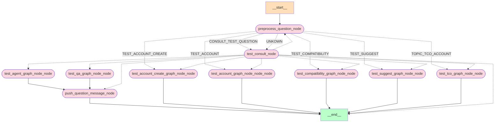
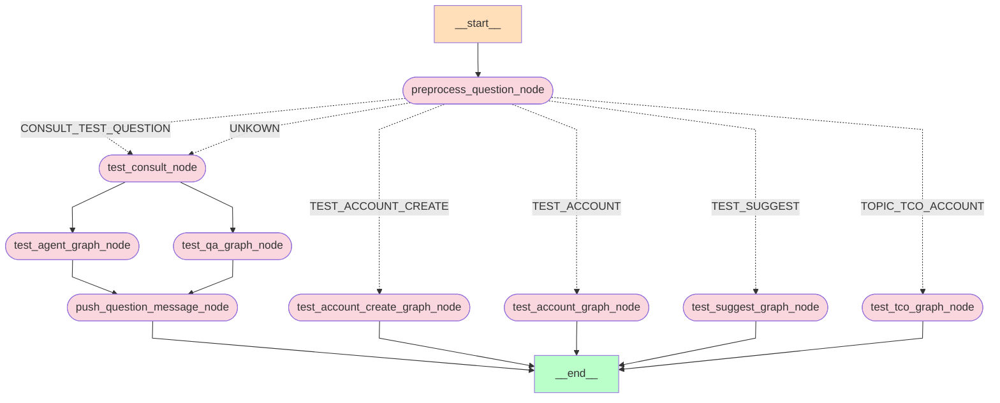

1. 
2. **符灿洋**
   - **寓意**：“灿”代表灿烂、光辉，体现火的特性；“洋”指广阔的海洋，寓意宝宝未来广阔无垠，生活丰富多彩。
3. **符俊逸**
   - **寓意**: “俊”指英俊、出众，“逸”代表超凡脱俗，寓意宝宝才华出众，气质卓然。

1. **符洺宇**
   - **寓意**：“洺”表示清澈的水流；“宇”象征广阔的空间，寓意宝宝温润如水，未来宽广无际。
2. **符景涛**
   - **寓意**：“景”代表美好、光明，“涛”象征江河奔涌，寓意宝宝的未来壮阔而辉煌。
3. **符煦泉**
   - **寓意**：“煦”指温暖的阳光，象征火元素；“泉”则代表泉水，寓意生命之源，结合火与水的意象，寓意宝宝温暖如春，灵动婉转。
4. **符浩然**
   - **寓意**：“浩”代表广阔的水面，象征着包容与丰富；“然”意为自然、顺畅，整体表达了胸怀宽广、个性洒脱的气质。
5. **符焕溪**
   - **寓意**：“焕”象征光明和热情，符合火的元素；“溪”指小河，象征温柔与流动，寓意宝宝既有内在的热情，又具备灵动的性格，能在生活中如溪水般自如流动。






```java

```

1   public class Calculator {   2       private int add(int a, int b) {   3           return a + b; // 返回两个参数的和   4       }   5       public int subtract(int a, int b) {   6           return a - b; // 返回两个参数的差   7       }   8   }  