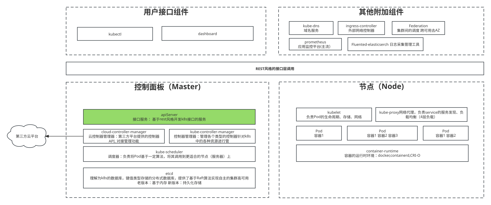
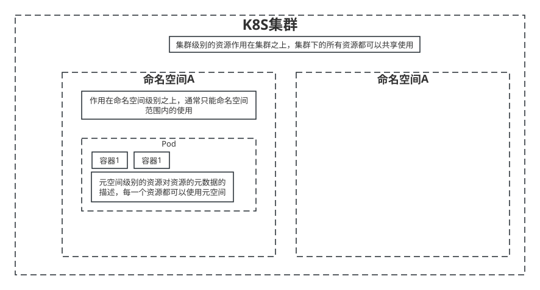
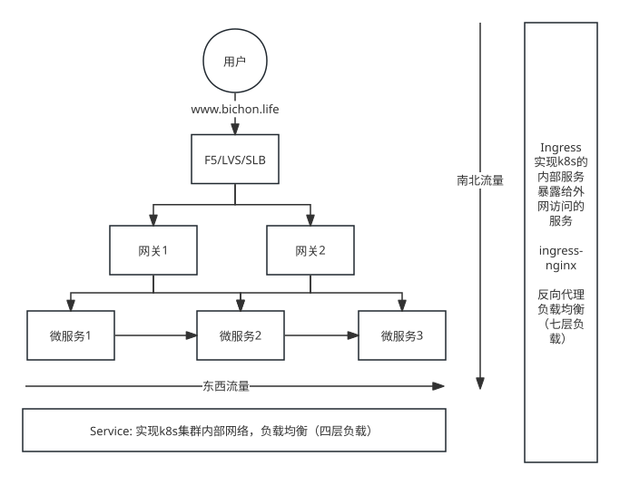
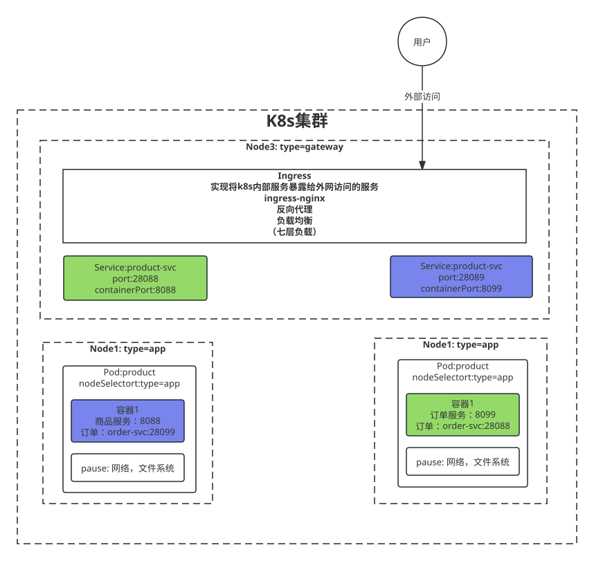

## 什么是k8s

管理集群式的容器docker

## K8S核心概念

k8s框架分层

**生态系统 -> 接口层 -> 管理层 -> 应用层 -> 核心层**

以下是K8S的基础组件框架图

### 

## 资源和资源清单

### 资源的分类

+ 元数据

+ 集群级别

+ 命名空间级别

  

#### 元数据类型（常用）

+ HPA： 扩缩容

+ PodTemplate 描述pod

+ LimitRange 对集群requests和limists资源的限制，

#### 集群级别（常用）

+ namespace

+ node 只是管理节点

+ clusterRole 集群的角色，仅声明

+ ClusterRoleBinding 绑定到对应集群

#### 命名空间（重要）（常用）

+ 工作负载型 Pod

  + 副本（replicas) --基于pod创建多个的副本，副本怎样创建尼

  + 控制器 --描述pod的

    + 适用无状态服务 --nginx **无状态的服务使用Deployment部署即可**

      + RepliactionController(RC) --帮助我们自动创建多个Pod副本数，动态扩缩容 （基本废弃，使用RS）

      + ReplicaSet(RS) -- RC->RS升级  和RC比较像，同样帮助我们动态更新Pod的副本数，可以通过selector来选择对哪些pod生效 （进一步抽象，使用Deployment）

        + Lable  --标签标记POD进行分类
        + Selector

      + Deployment --RS -> Deployment 进一步升级，针对RS进行了更改层次的封装，提供了更丰富的功能，Deployment 可以管理多个RS

        1. 创建Replicat Set/POD

        2. 平滑自动扩缩副本
        3. 滚动升级 灰度 蓝绿发布 RS1 -> RS2 
        4. 暂停/恢复

    + 适用有状态服务 StatefulSet  ---redis mysql

      主要特点：

      1. 稳定的持久化存储
      2. 稳定的网络标志
      3. 有序部署，有序扩展  必须0-1的部署完成后才部署3
      4. 有序收缩，有序删除

      组成： （解决网络和存储的问题）

      + Headless Service --对于有状态服务的DNS管理

        用于定于网络标志，域名服务，将域名与IP绑定映射关系，自动帮我们POD绑定到一个域名上

        pod的DNS格式为：statefulSetName-[0,1,...,N].serviceName.namespace.clister.svc.cluster.local

        例如： redis-lxr-0.redis-lxr.mywork.svc.cluster.local

      + vlolumeClainTemplate

        用于创建持久化的模板

    + 守护进程 DaemonSet

      构建POD的守护进程，为每一个匹配的Pod都部署该守护进程

      + 日志收集： 比如flume,logstash等
      + 系统监控： 比如Prometheus Node Exporter, collectd, New Relic agent , Ganglia gmond等
      + 系统程序:  比如kube-proxy,kube-dns,glusterid,ceph

    + 任务/定时任务

      + Job

        一次性任务，运行完后就销毁这个Pod

      + CronJob

        周期性执行某个任务的Pod

+ 服务发现

  

  + Service --东西流量 不同节点不同pod的网络访问
  + Ingress --南北流量 外部到内部流量的网络访问



+ 存储
  + Volume --虚拟数据卷 共享Pod中容器的数据，用来持久化的数据，比如数据库的数据
  + CSI --容器标准化的接口，暴露容器化存储的标准接口，类似 JAVA的 CSI
+ 特殊类型的配置
  + configMap --该配置可以让pod加载配置，暴露容器内部的配置，配置热更新
  + secret --多了加密的功能， 不用明文存储
    + service Account
    + Opaque: 就是用base64编码
  + DownwardAPI --将Pod的信息注入到容器内部去
+ 其他
  + Role --定义命名空间级别的权限
  + RoleBinding --绑定到命名空间

## 为什么要POD

+ IPC（ip层链接）
  + Network
    + PID
      + Hostname
        + pause
          + docker1
          + docker2

1. 共享网络
2. 共享文件夹卷
3. 容器组概念
4. 最小的可部署单元
5. 希望耦合对较高的容器应用放在同一个pod，更多的时候一个pod一个容器

## 对象的规约(Spec)和状态 --- 描述POD

spec规约是对kublets对象的一种期望设定

状态时对kubeletes对象最终展示的实际状态


## K8S如何进行实战

### 搭建方案

+ minikube

+ kubeadm（使用这个）
+ 二进制安装
+ 命令工具

### kubeadm基础安装方案

#### 服务器要求

至少一台master，一台node

最低配置 2核 2G 20G

最好联网，不能联网的话需要有提供对应镜像的私有仓库

#### 软件环境

操作系统：linux系统 2C 2G 5Mbps

Docker: 20+

k8s: 1.23.6 此后k8s将不支持docker 因为 谷歌CSI容器规范的推行

#### 安装过程

+ 初始化操作

```shell
# 关闭防火墙
sudo ufw status
# inactive 表示关闭
sudo systemctl stop ufw
sudo systemctl disable ufw
sudo systemctl disable --now ufw

# 关闭selinux
sed -i 's/enforcing/disabled/' /etc/selinux/config # 永久
setenforce 0 # 临时

# 关闭swap**要重启**
swapoff -a # 临时
sed -ri 's/.*swap.*/#&/' /etc/fstab # 永久

# 关闭swap后，一定要重启一下虚拟机！！！
# 根据规划设置主机名
hostnamectl set-hostname <hostname>
hostnamectl set-hostname k8s-master
hostnamectl set-hostname k8s-tx-cd1-node1

# 在master添加hosts
cat >> /etc/hosts << EOF
192.168.10.100 k8s-master
192.168.10.101 k8s-node1
192.168.10.102 k8s-node2
192.168.10.103 k8s-node3
192.168.10.104 k8s-node4
192.168.10.105 k8s-node5
EOF

# 将桥接的IPV4流量传送到/iptables的链
cat > /etc/sysctl.d/k8s.conf << EOF
net.bridge.bridge-nf-call-ip6tables=1
net.bridge.bridge-nf-call-iptables=1
EOF

sysctl --system # 生效

# 时间同步
sudo apt-get update
sudo apt-get install ntpdate
ntpdate time.windows.com
```


+ 安装基础软件（所有节点）

 	1. 安装docker 20.10

```shell
sudo apt update

sudo apt install apt-transport-https ca-certificates curl software-properties-common

curl -fsSL http://mirrors.aliyun.com/docker-ce/linux/ubuntu/gpg | sudo apt-key add -

sudo add-apt-repository "deb [arch=amd64] http://mirrors.aliyun.com/docker-ce/linux/ubuntu $(lsb_release -cs) stable"

sudo apt update

# 按版本安装
sudo apt-cache policy docker-ce docker-ce-cli containerd.io
sudo apt install docker-ce=5:20.10.24~3-0~ubuntu-jammy docker-ce-cli=5:20.10.24~3-0~ubuntu-jammy containerd.io

sudo apt install docker-ce=5:20.10.24~3-0~ubuntu-bionic docker-ce-cli=5:20.10.24~3-0~ubuntu-bionic containerd.io

sudo apt install docker-ce=5:20.10.24~3-0~ubuntu-focal docker-ce-cli=5:20.10.24~3-0~ubuntu-focal containerd.io


sudo systemctl status docker
docker --version

# 添加docker用户
sudo usermod -aG docker $USER

sudo systemctl restart docker

# 配置关闭 Docker 的cgroups, 修改
/etc/docker/daemon.json，加入
"exec-opts": ["native.cgroupdriver=systemd"]

{
"registry-mirrors": ["https://3laho3y3.mirror.aliyuncs.com"],
"exec-opts": ["native.cgroupdriver=systemd"]
}

sudo systemctl restart docker

# 重新安装
sudo apt remove docker-ce docker-ce-cli docker docker-engine docker.io containerd runc

```


2. 添加阿里源
3. 安装kubeadm、kubelet、kubectl

```shell
sudo apt-get update && sudo apt-get install -y apt-transport-https

sudo curl https://mirrors.aliyun.com/kubernetes/apt/doc/apt-key.gpg | sudo apt-key add -

cat << EOF >/etc/apt/sources.list.d/kubernetes.list
deb https://mirrors.aliyun.com/kubernetes/apt/ kubernetes-xenial main
EOF

# 问题
__bp_precmd_invoke_cmd: command not found
__bp_interactive_mode: command not found

# 进入root
ls -a
vim .bashrc
source .bashrc
# 在行尾添加unset PROMPT_COMMAND

sudo apt-get update

sudo apt install kubelet=1.23.6-00 kubeadm=1.23.6-00 kubectl=1.23.6-00
sudo apt remove kubelet=1.23.6-00 kubeadm=1.23.6-00 kubectl=1.23.6-00
sudo systemctl enable --now kubelet

# 重启 docker
sudo systemctl daemon-reload
sudo systemctl restart docker

# 重启 kubelet
sudo systemctl restart kubelet
```

+ master节点部署

```shell
# 开放安全组端口
# 从任何位置到目标端口22的SSH流量（通常是TCP端口22）。
# 从任何位置到目标端口6443的Kubernetes API服务器访问（通常是TCP端口6443）。
# 节点间通信的端口范围：从30000到32767，这些端口用于NodePort服务。

# 设置响应service 和 pod的网段 
# master 分别指定内外网 面板用外网
kubeadm init \
--control-plane-endpoint=192.168.10.100 \
--apiserver-advertise-address=192.168.10.100 \
--image-repository registry.aliyuncs.com/google_containers \
--kubernetes-version v1.23.6 \
--service-cidr=10.96.0.0/12 \
--pod-network-cidr=10.244.0.0/16

# 排查问题
journalctl -xeu kubelet

# 8080 kubectl问题 api问题
echo "export KUBECONFIG=/etc/kubernetes/admin.conf" >> ~/.bash_profile
source ~/.bash_profile

# 还原
kubeadm reset

journalctl -fu kubelet

rm -rf $HOME/.kube

systemctl restart kubelet

# 成功后 
mkdir -p $HOME/.kube
sudo cp -i /etc/kubernetes/admin.conf $HOME/.kube/config
sudo chown $(id -u):$(id -g) $HOME/.kube/config

记住join
kubeadm join 118.24.37.154:6443 --token ce86eo.u4gia0nuur2obscm --discovery-token-ca-cert-hash sha256:9d38c950e96cbaa956fe27debdeba35e56e6d1186f0d637225cc0a967f4345cc
kubeadm join 118.24.37.154:6443 --token i1sj1s.4is9bgmhkq5rxnpy --discovery-token-ca-cert-hash sha256:029d5d4d3a9d0a2359ff29a87f607023861e066d898e480f1474a1ad72911220
kubeadm join 192.168.10.100:6443 --token 8u2dlb.ncdalz2k0e876l95 --discovery-token-ca-cert-hash sha256:9301b3ddc840f62c54cc3c48e4ddc119d142108af816d287f2758d9f934ae034

kubeadm join 192.168.10.100:6443 --token 840e8q.mut8shzekysj512t --discovery-token-ca-cert-hash sha256:09e2143e79980fd5b8217197be3df9f2d85e00e8c077c251b1cc8466c269853f

1、修改hostname
sudo hostnamectl set-hostname k8s-tx-cd1-node1
2、添加hosts
172.27.0.4 k8s-master
172.27.0.4 docker-proxy-registry
3、重置k8s
sudo kubeadm reset
4、加入节点
sudo kubeadm join k8s-master:6443 --token g7kw5g.tccqhx3pdb2hebji --discovery-token-ca-cert-hash sha256:be2aec960a88eef7e0e819b4aa470e4e6c8f45aa067d21cf74ccbe57de5f051c

```

+ 加入node节点

```shell
kubeadm join 118.24.37.154:6443 --token <master 控制台的token> --discovery-token-ca-cert-hash <master 控制台的 hash>

# token不知道怎么办
kubeadm token list # 可以查看过期
kubeadm token create # 过期可以创建新的
# hash值
openssl x509 -pubkey -in /etc/kubernetes/pki/ca.crt | openssl rsa -pubin -outform der 2>/dev/null | openssl dgst -sha256 -hex | sed 's/^.* //'
sha256:c4e9b4fdefc1d37e59a91878717c0ad6d46a2b0e92fe7cd42aff0cb93986b2c9
```

+ 部署CNI网络插件

```shell
cd /opt
mkdir k8s

curl https://docs.projectcalico.org/manifests/calico.yaml -O
kubectl apply -f "https://docs.projectcalico.org/manifests/calico.yaml"
curl https://calico-v3-25.netlify.app/archive/v3.25/manifests/calico.yaml -O
# 修改该文件的cidr配置，修改为与初始化的cidr相同
CALICO_IPV4POOL_CIDR 改成pod那个
IP_AUTODETECTION_METHOD 

- name: CLUSTER_TYPE
  value: "k8s,bgp" 
下增加两行

- name: IP_AUTODETECTION_METHOD
  value: "interface=enp0s3"

sed -i 's#docker.io/##g' calico.yaml
grep image calico.yaml
kubectl apply -f calico.yaml
kubectl get po -n kube-system
kubectl describe po calico-node-frxkk -n kube-system
```

+ 任意node 使用kubectl

1. 将master节点中 /etc/kubernetes/admin.conf 拷贝到需要运行的服务器的 /etc/kubernetes 目录中

   ```shell
   sudo scp /etc/kubernetes/admin.conf lxr@k8s-node1:/etc/kubernetes
   ```

2. 在对应的服务器上配置环境变量

```shell
echo "export KUBECONFIG=/etc/kubernetes/admin.conf" >> ~/.bash_profile
```

sudo scp


## 数据存储

### NFS的使用（非高并发的共享）

1. windows 添加 NFS 

``` SHELL
D:\nfs -name:nfs -maproot:0 -public *(rw,sync,no_subtree_check,no_root_squash)
```

2. 开放防火墙 111,1058,2049

3. ubuntu 安装NFS服务

 ```shell
 # 服务端节点
 apt install nfs-kernel-server
 
 # 客户端节点
 apt install nfs-common
 
 sudo systemctl status nfs-server
 
 sudo vim /etc/exports
 /home/nfs 192.168.10.0/24(rw,sync,no_subtree_check,no_root_squash)
 
 
 # 目录创建
 sudo mount -t nfs -o nolock 192.168.10.130:/nfs /mnt/nfs
 ```


### PV和PVC

作为K8S的存储规范的抽象

 POD -> PVC -> PV

 动态申请PV storageClass 

POD -> PVC -> StorageClass 自动制备器 Provisioner  -> PV

制备器需要自己构建

创建NFS Provisioner RBAC鉴权

```shell
vi /root/nfs-provisioner-rbac.yaml
```

```yaml
apiVersion: v1
kind: ServiceAccount
metadata:
  name: nfs-client-provisioner
  namespace: kube-system
---
kind: ClusterRole
apiVersion: rbac.authorization.k8s.io/v1
metadata:
  name: nfs-client-provisioner-runner
rules:
- apiGroups: [""]
  resources: ["persistentvolumes"]
  verbs: ["get", "list", "watch", "create", "delete"]
- apiGroups: [""]
  resources: ["persistentvolumeclaims"]
  verbs: ["get", "list", "watch", "update"]
- apiGroups: [""]
  resources: ["endpoints"]
  verbs: ["get", "list", "watch", "create", "update", "patch"]
- apiGroups: ["storage.k8s.io"]
  resources: ["storageclasses"]
  verbs: ["get", "list", "watch"]
- apiGroups: [""]
  resources: ["events"]
  verbs: ["create", "update", "patch"]
---
kind: ClusterRoleBinding
apiVersion: rbac.authorization.k8s.io/v1
metadata:
  name: run-nfs-client-provisioner
subjects:
- kind: ServiceAccount
  name: nfs-client-provisioner
  namespace: kube-system
roleRef:
  kind: ClusterRole
  name: nfs-client-provisioner-runner
  apiGroup: rbac.authorization.k8s.io
---
kind: Role
apiVersion: rbac.authorization.k8s.io/v1
metadata:
  name: leader-locking-nfs-client-provisioner
rules:
- apiGroups: [""]
  resources: ["endpoints"]
  verbs: ["get", "list", "watch", "create", "update", "patch"]
---
kind: RoleBinding
apiVersion: rbac.authorization.k8s.io/v1
metadata:
  name: leader-locking-nfs-client-provisioner
subjects:
- kind: ServiceAccount
  name: nfs-client-provisioner
  # replace with namespace where provisioner is deployed
  namespace: kube-system
roleRef:
  kind: Role
  name: leader-locking-nfs-client-provisioner
  apiGroup: rbac.authorization.k8s.io
```

nfs-storage-class.yaml

storageClass

```yaml
apiVersion: storage.k8s.io/v1
kind: StorageClass
metadata:
  name: managed-nfs-storage
provisioner: fuseim.pri/ifs
parameters:
  archiveOnDelete: "false" # 是否存档 false 表示不存档，会删除 oldPath 下的数据，true表示会存档，会重命名路径
reclaimPolicy: Retain # 回收策略， 默认为 Delete  可以配置为 Retain 
volumeBindingMode: Immediate # 默认为 Immediate，表示创建 PVC 立即绑定，只有azuredisk 和 AWSelasticblockstore 支持其他值  
```

nfs-provisioner-deployment.yaml

provisioner

```yaml
apiVersion: v1
kind: ServiceAccount
metadata:
  name: nfs-client-provisioner
  namespace: kube-system
---
kind: Deployment
apiVersion: apps/v1
metadata:
  namespace: kube-system
  name: nfs-client-provisioner
  labels:
    app: nfs-client-provisioner
spec:
  replicas: 1
  strategy:
    type: Recreate
  selector:
    matchLabels:
      app: nfs-client-provisioner
  template:
    metadata:
      labels:
        app: nfs-client-provisioner
    spec:
      serviceAccount: nfs-client-provisioner
      containers:
        - name: nfs-client-provisioner
#          image: quay.io/external_storage/nfs-client-provisioner:latest
          image: registry.cn-beijing.aliyuncs.com/pylixm/nfs-subdir-external-provisioner:v4.0.0
          volumeMounts:
            - name: nfs-client-root
              mountPath: /persistentvolumes
          env:
            - name: PROVISIONER_NAME
              value: fuseim.pri/ifs # 对应 sc 里面的provisioner 的名称
            - name: NFS_SERVER
              value: 192.168.10.100 # nfs 服务的IP 和 路径 都需要关联上才行
            - name: NFS_PATH
              value: /mnt/nfs
      volumes:
        - name: nfs-client-root
          nfs:
            server: 192.168.10.100
            path: /mnt/nfs        
```

nfs-sc-demo-statefulset.yaml

集中测试

```yaml
---
apiVersion: v1
kind: Service
metadata:
  name: nginx-sc
  labels:
    app: nginx-sc
spec:
  type: NodePort
  ports:
  - name: web
    port: 80
    protocol: TCP
  selector:
    app: nginx-sc
---  
apiVersion: apps/v1
kind: StatefulSet
metadata:
  name: nginx-sc
spec:
  replicas: 1
  serviceName: "nginx-sc" # 对应上面的 Service 
  selector:
    matchLabels:
      app: nginx-sc # 匹配到下面的 Pod 的标签配置
  template:
    metadata:
      labels:
        app: nginx-sc # Pod 模板标签
    spec:
      containers:
      - image: nginx
        name: nginx-sc
        imagePullPolicy: IfNotPresent
        volumeMounts:
        - mountPath: /usr/share/nginx/html # 挂载到容器的哪个目录
          name: nginx-sc-test-pvc # 挂载哪个 volume
          subPath: /bichon/nginx/html
  volumeClaimTemplates:
  - metadata:
      name: nginx-sc-test-pvc
    spec:
      storageClassName: managed-nfs-storage
      accessModes:
      - ReadWriteMany
      resources:
        requests:
          storage: 1Gi
```

单独测试创建pvc

```shell
kubectl apply -f auto-pv-test-pvc.yaml
```

```yaml
apiVersion: v1
kind: PersistentVolumeClaim
metadata:
  name: auto-pv-test-pvc
spec:
  accessModes:
  - ReadWriteMany
  resources:
    requests:
      storage: 300Mi
  storageClassName: managed-nfs-storage
```

```shell
# 查看storageClass
kubectl get sc
kubectl get sts
```


### 指标监控

```yaml
apiVersion: v1
kind: ServiceAccount
metadata:
  labels:
    k8s-app: metrics-server
  name: metrics-server
  namespace: kube-system
---
apiVersion: rbac.authorization.k8s.io/v1
kind: ClusterRole
metadata:
  labels:
    k8s-app: metrics-server
    rbac.authorization.k8s.io/aggregate-to-admin: "true"
    rbac.authorization.k8s.io/aggregate-to-edit: "true"
    rbac.authorization.k8s.io/aggregate-to-view: "true"
  name: system:aggregated-metrics-reader
rules:
- apiGroups:
  - metrics.k8s.io
  resources:
  - pods
  - nodes
  verbs:
  - get
  - list
  - watch
---
apiVersion: rbac.authorization.k8s.io/v1
kind: ClusterRole
metadata:
  labels:
    k8s-app: metrics-server
  name: system:metrics-server
rules:
- apiGroups:
  - ""
  resources:
  - pods
  - nodes
  - nodes/stats
  - namespaces
  - configmaps
  verbs:
  - get
  - list
  - watch
---
apiVersion: rbac.authorization.k8s.io/v1
kind: RoleBinding
metadata:
  labels:
    k8s-app: metrics-server
  name: metrics-server-auth-reader
  namespace: kube-system
roleRef:
  apiGroup: rbac.authorization.k8s.io
  kind: Role
  name: extension-apiserver-authentication-reader
subjects:
- kind: ServiceAccount
  name: metrics-server
  namespace: kube-system
---
apiVersion: rbac.authorization.k8s.io/v1
kind: ClusterRoleBinding
metadata:
  labels:
    k8s-app: metrics-server
  name: metrics-server:system:auth-delegator
roleRef:
  apiGroup: rbac.authorization.k8s.io
  kind: ClusterRole
  name: system:auth-delegator
subjects:
- kind: ServiceAccount
  name: metrics-server
  namespace: kube-system
---
apiVersion: rbac.authorization.k8s.io/v1
kind: ClusterRoleBinding
metadata:
  labels:
    k8s-app: metrics-server
  name: system:metrics-server
roleRef:
  apiGroup: rbac.authorization.k8s.io
  kind: ClusterRole
  name: system:metrics-server
subjects:
- kind: ServiceAccount
  name: metrics-server
  namespace: kube-system
---
apiVersion: v1
kind: Service
metadata:
  labels:
    k8s-app: metrics-server
  name: metrics-server
  namespace: kube-system
spec:
  ports:
  - name: https
    port: 443
    protocol: TCP
    targetPort: https
  selector:
    k8s-app: metrics-server
---
apiVersion: apps/v1
kind: Deployment
metadata:
  labels:
    k8s-app: metrics-server
  name: metrics-server
  namespace: kube-system
spec:
  selector:
    matchLabels:
      k8s-app: metrics-server
  strategy:
    rollingUpdate:
      maxUnavailable: 0
  template:
    metadata:
      labels:
        k8s-app: metrics-server
    spec:
      containers:
      - args:
        - --cert-dir=/tmp
        - --kubelet-insecure-tls
        - --secure-port=4443
        - --kubelet-preferred-address-types=InternalIP,ExternalIP,Hostname
        - --kubelet-use-node-status-port
        image: registry.cn-hangzhou.aliyuncs.com/lfy_k8s_images/metrics-server:v0.4.3
        imagePullPolicy: IfNotPresent
        livenessProbe:
          failureThreshold: 3
          httpGet:
            path: /livez
            port: https
            scheme: HTTPS
          periodSeconds: 10
        name: metrics-server
        ports:
        - containerPort: 4443
          name: https
          protocol: TCP
        readinessProbe:
          failureThreshold: 3
          httpGet:
            path: /readyz
            port: https
            scheme: HTTPS
          periodSeconds: 10
        securityContext:
          readOnlyRootFilesystem: true
          runAsNonRoot: true
          runAsUser: 1000
        volumeMounts:
        - mountPath: /tmp
          name: tmp-dir
      nodeSelector:
        kubernetes.io/os: linux
      priorityClassName: system-cluster-critical
      serviceAccountName: metrics-server
      volumes:
      - emptyDir: {}
        name: tmp-dir
---
apiVersion: apiregistration.k8s.io/v1
kind: APIService
metadata:
  labels:
    k8s-app: metrics-server
  name: v1beta1.metrics.k8s.io
spec:
  group: metrics.k8s.io
  groupPriorityMinimum: 100
  insecureSkipTLSVerify: true
  service:
    name: metrics-server
    namespace: kube-system
  version: v1beta1
  versionPriority: 100
```

https://kubesphere.io/zh/docs/v3.3/installing-on-linux/persistent-storage-configurations/install-nfs-client/

```shell
curl -X GET https://github.com/kubesphere/ks-installer/releases/download/v3.3.2/kubesphere-installer.yaml -O
 
curl -X GET https://github.com/kubesphere/ks-installer/releases/download/v3.3.2/cluster-configuration.yaml -O

```


持久卷被配置为:namespace-{namespace}-namespace-{pvcName}-${pvName}

  

## kubeadm TEST

kubectl create deployment nginx --image=nginx

kubectl expose deployment nginx --port=80 --type=NodePort

kubectl get pod,svc


+ 端口

`Calico` （`CNI` 网络插件） 则需要 `179`、`4789`、`9099` 端口。

类型	端口	描述	使用者	初次安装 k8s 所需端口
TCP	22	SSH 连接端口		
TCP/UDP	53	集群 DNS 服务		需要
TCP	179	CNI网络插件 calico		
TCP	2375	主机驱动与 Docker 守护进程通信的 TLS 端口，容器运行时可以选择使用不同的端口，默认情况下 Docker 使用 2375 和 2376。		
TCP	2376	主机驱动与 Docker 守护进程通信的 TLS 端口，容器运行时可以选择使用不同的端口，默认情况下 Docker 使用 2375 和 2376。		
TCP	2379	etcd 客户端请求（供客户端访问）。	控制面：kube-apiserver, etcd	需要
TCP	2380	etcd 节点通信，用于 etcd 集群中的成员之间进行通信。	控制面：kube-apiserver, etcd	需要
UDP	8472	Canal/Flannel VXLAN overlay 网络		
UDP	4789	Flannel VXLAN overlay 网络、Calico 使用 VXLAN 封装来进行 Overlay 网络通信，该端口用于汇聚 VXLAN 流量。		
TCP	9099	Canal/Flannel 健康检查、Calico 控制面板端口		
TCP	9796	集群监控拉取节点指标的默认端口（仅需要内网可达）		
TCP	6783	Weave 端口		
UDP	6783，6784	Weave UDP 端口		
TCP/UDP	30000-32767	NodePort 端口范围，NodePort 是 Kubernetes Service 类型之一，它将某个 Service 暴露在 Node 的固定端口上。	所有	需要
TCP	6443	k8s kube-apiserver， 用于与 API Server 进行通信	所有	需要
TCP	9443	Rancher Webhooks		
TCP	80	Rancher 节点		
TCP	443	Rancher 节点		
TCP	10250	kubelet API；用于与 Kubelet 进行通信。	控制面：自身、工作节点：自身	需要
TCP	10251	kube-schedule，用于与 Scheduler 进行通信。	控制面：自身	需要
TCP	10252	kube-control，用于与 Controller Manager 进行通信		需要
TCP	10254	Ingress Controller 健康检查		
TCP	10255	kubelet API（只读）		需要
TCP	10256	kube-proxy		
TCP	10257	kube-controller-manager	控制面：自身	
TCP	10259	kube-schedule，用于与 Scheduler 进行通信。	控制面：自身	
TCP	8080	k8s kube-apiserver，HTTP 非安全端口，一般都是用 6443	


# 执行以下命令，下载脚本（使用加速节点）需要使用jq命令
cd && rm -f run.sh && curl -o run.sh -L $(curl -s https://api.akams.cn/github | jq -r '.data[0].url')/https://raw.githubusercontent.com/miracleEverywhere/dst-management-platform-api/master/run.sh && chmod +x run.sh && ./run.sh	